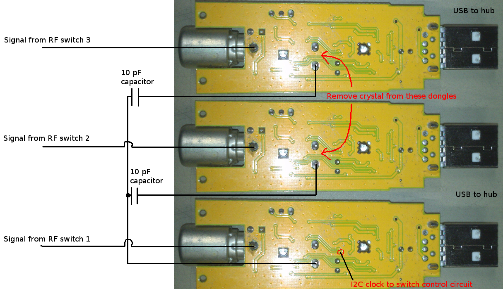
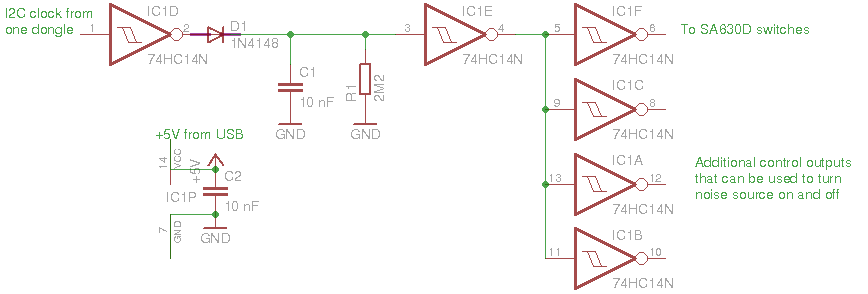
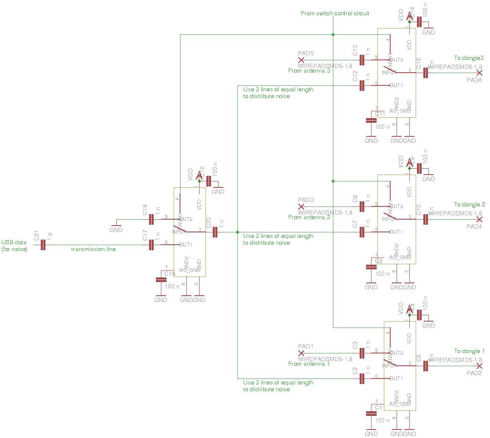
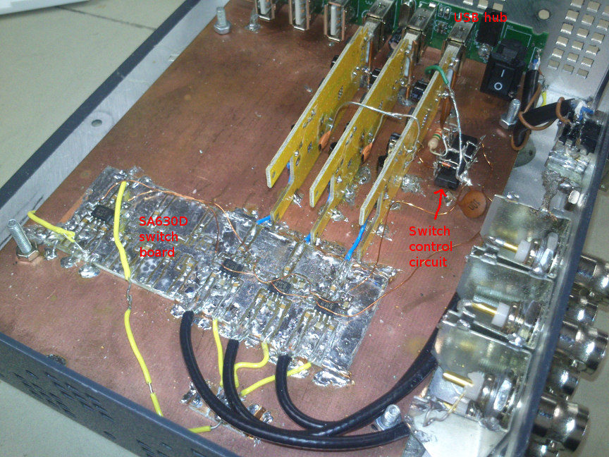

Hardware for three dongles
==========================

This is the simple hardware with 3 dongles that has been used for most of tests
for now.

One of the dongles has the original 28.8 MHz crystal in place and other 2
dongles have the crystal removed. Clock is distributed from one dongle to
crystal pins of the two other dongles through 10 pF capacitors:

The inputs of the dongles get signal through SA630D switches controlled by a
switch control circuit:

Here's a schematic of the switch board:

(TODO: make it look more clear and learn to properly use some PCB design
software...)

One of USB data lines is used as the noise source.
It's not the best way but somewhat works.

Here's picture of the hardware to help understand how it's actually built:

